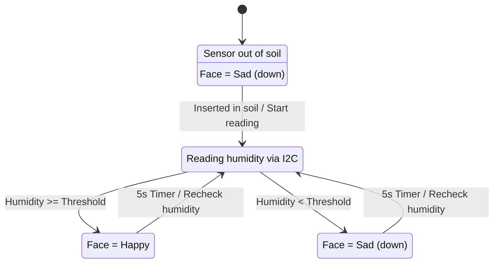

# 🌱 Eustaquia

Eustaquia is a playful project that lets a plant “talk” when it’s thirsty.
Using a [GRiSP2 board](https://www.grisp.org) running Erlang, it reads soil humidity and moves a face from happy 😀 to sad 😢 with a servo motor — a fun, beginner‑friendly way to explore GRiSP, embedded Erlang, and simple electronics.


## 🌀 How?



In words:

1. When the sensor is not inserted, the face is tilted down (sad).
2. When placed in the soil, it reads humidity every 5 seconds via I2C.
3. If humidity is above a threshold, Eustaquia smiles 😀.
4. If humidity is below the threshold, it stays sad 😢.

> ⚠️ The initial state looks just like the “sad” face. To verify that everything is working, dip the sensor in water and watch it change to happy.

## 🧠 Useful Concepts

- **I2C (Inter-Integrated Circuit)**: A protocol that lets components to exchange data using only two lines: SDA, for transmitting data and SCL, for providing the clock signal that synchronizes communication. Supported by GRiSP through its. It is supported by GRiSP via its [I2C library](https://hexdocs.pm/grisp/grisp_i2c.html). Used here to read soil moisture levels.

- **PWM (Pulse Width Modulation)**: A technique that regulates the power delivered to a device by rapidly switching the signal on and off. The duty cycle (percentage of time the signal is on) determines the output power—0% for fully off, 50% for half power, and 100% for fully on. Supported by GRiSP via its [PWM library](https://hexdocs.pm/grisp/grisp_pwm.html), making it ideal for controlling a servomotor to animate a sad face or a smile face.

## 🛠️ Components and how to connect them

To bring your plant project to life, you’ll need:

- 🟩 **[GRiSP2 embedded board](https://www.grisp.org/hardware)** – runs Erlang/Elixir directly on RTEMS, no Linux needed.
- 🔌 **USB cable (micro-USB)** – To power the board and access the console
- 💾 **microSD card** (optional) – For deploying your application. If your GRiSP board is already linked to [GRiSP.io](https://grisp.io/), you can deploy software updates remotely (OTA) without needing a microSD card or USB cable.
- 🪴 **Capacitive soil moisture sensor** – I used an [Adafruit Soil Moisture Sensor (I²C)](https://www.adafruit.com/product/4026) model; corrosion-proof and stable readings.
- ⚙️ **SG90 servo motor** (or similar) – To move Eustaquia’s face
- 🔌 [PMOD CON3: R/C Servo Connectors](https://digilent.com/shop/pmod-con3-r-c-servo-connectors/) – Easily connect the servo to GRiSP without soldering
- 🔋 **Power source** for the servo
- 🧵 **Jumper wires** – For connections.
- 🎨 **A face for Eustaquia** – Cardboard, 3D print, markers… get creative!

How to connect them: TODO

## ⚙️ Build using a SD-Card

1. Compile the application locally: ``rebar3 compile``
2. Flash and deploy the application to a GRiSP device: `rebar3 grisp deploy`
3. Insert the SD card into the GRiSP board and power it up.

ℹ️ For more information on how this process works, check the [GRiSP wiki](https://github.com/grisp/grisp/wiki).

## 📦 Documentation

Generate documentation locally:

```sh
rebar3 ex_doc
open doc/index.html
```

## 🧪 Testing

You can manually test Eustaquia by connecting to the shell on the GRiSP board ([over a Serial](https://github.com/grisp/grisp/wiki/Connecting-over-Serial), for example) and running the provided test functions:

Inside the Erlang shell:

```erl
1> eustaquia:test_moisture().
%% → Reads the current soil moisture value once.

2> eustaquia:test_servo_happy().
%% → Moves the servo to the "happy" 😀 position.

3> eustaquia:test_servo_sad().
%% → Moves the servo to the "sad" 😢 position.
```

These commands let you verify that the sensor and servo are working correctly before running the full application loop.

## 🔮 Future Ideas

- 📱 **Notifications**: Send a message to your phone when Eustaquia is thirsty.
- 🌿 **Plant network**:  Imagine a “neighborhood watch” for plants — if one plant is thirsty 😢, nearby plants running on BEAM nodes can exchange messages to react in sympathy, creating a collective sadness that shows exactly where water is needed.
