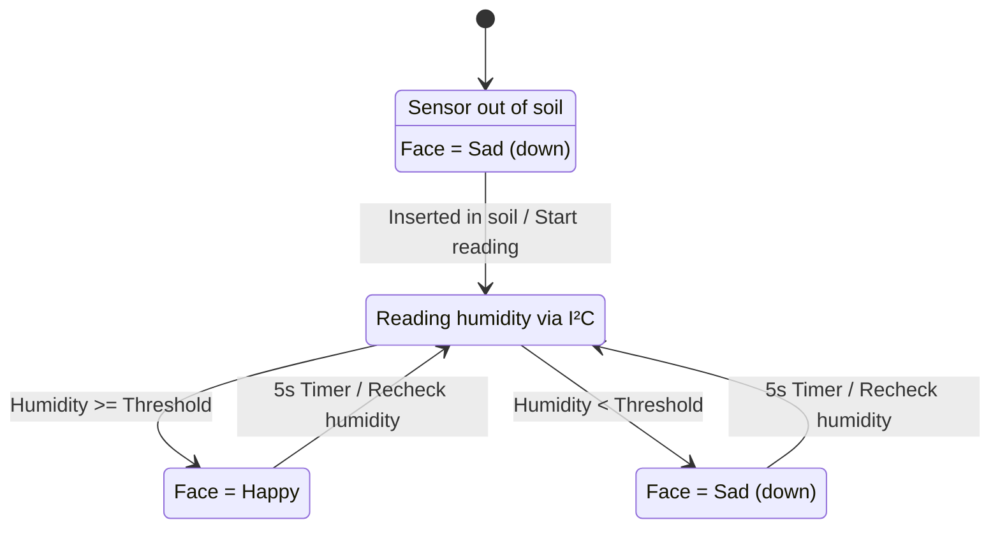

# 🌱 Eustaquia

Eustaquia is a playful project that lets a plant “talk” when it’s thirsty. A [GRiSP2 board](https://www.grisp.org) running Erlang reads soil humidity via I²C and drives a servo to switch a face from happy 😀 to sad 😢 — a simple way to explore GRiSP, embedded Erlang, and basic electronics.

<table>
<tr><th>Animation Example</th><th>Real test</th></tr>
<tr><td></td><td></td></tr>
</table>

## How it works


```mermaid
stateDiagram-v2
    [*] --> OutOfSoil

    OutOfSoil : Sensor out of soil
    OutOfSoil : Face = Sad (down)
    OutOfSoil --> Measuring : Inserted in soil / Start reading

    Measuring : Reading humidity via I²C
    Measuring --> Happy : Humidity >= Threshold
    Measuring --> Sad : Humidity < Threshold

    Happy : Face = Happy
    Happy --> Measuring : 5s Timer / Recheck humidity

    Sad : Face = Sad (down)
    Sad --> Measuring : 5s Timer / Recheck humidity
```

In short:

1. When the sensor is not in the soil, the face stays down (sad).
2. Once in the soil, humidity is read every 5 seconds over I²C.
3. If humidity is above the threshold → Eustaquia smiles 😀.
4. If humidity is below the threshold → face stays sad 😢.

> **Tip:** The initial state looks like the sad face. To confirm everything works, dip the sensor in water and watch it switch to happy.

## Concepts

- **I²C (Inter-Integrated Circuit)** — Protocol for talking to devices over two lines: **SDA** (data) and **SCL** (clock). GRiSP supports it via [grisp_i2c](https://hexdocs.pm/grisp/grisp_i2c.html). Used here to read the soil moisture sensor (seesaw protocol).

- **PWM (Pulse Width Modulation)** — You turn the signal on and off quickly; the duty cycle (percentage of time on) controls the effect. GRiSP provides [grisp_pwm](https://hexdocs.pm/grisp/grisp_pwm.html), which we use to drive the servo (happy vs sad position).

## Components and wiring

See **[docs/WIRING.md](docs/WIRING.md)** for the step-by-step wiring guide.

<table>
<tr><th>Real Image 1</th><th>Real Image 2</th></tr>
<tr><td></td><td></td></tr>
</table>

## Build and deploy (SD card)

1. **Compile:** `rebar3 compile`
2. **Deploy to GRiSP:** `rebar3 grisp deploy`
3. Insert the SD card into the board and power it on.

See the [GRiSP wiki](https://github.com/grisp/grisp/wiki) for more detail.

## Documentation

Generate docs locally:

```sh
rebar3 ex_doc
open doc/index.html
```

- **[docs/IMPLEMENTATION.md](docs/IMPLEMENTATION.md)** (EN) / **[docs/IMPLEMENTACION.md](docs/IMPLEMENTACION.md)** (ES) — full implementation guide.
- **[docs/WIRING.md](docs/WIRING.md)** — wiring and connection guide.

## Testing

Connect to the GRiSP shell (e.g. [over serial](https://github.com/grisp/grisp/wiki/Connecting-over-Serial)), then run the tests below.

### Step 1 — Hardware

- Power the GRiSP (USB or external).
- Plug the **PMOD I²C** into the board (external bus, usually `i2c1`).
- Connect the **soil sensor** with the 4-wire cable: **VIN** → PMOD VCC, **GND** → GND, **SDA** → SDA, **SCL** → SCL. Do not swap SDA and SCL.
- If using the servo: connect the PMOD R/C Servo and servo as described above.

### Step 2 — Compile and flash

- In the project root: `rebar3 compile`. Fix any deps with `rebar3 deps` if needed.
- Flash: `rebar3 grisp deploy` (or `rebar3 grisp burn`). Insert the SD card if required, then power the board.

### Step 3 — Open the Erlang shell

- Connect over serial (see [GRiSP wiki](https://github.com/grisp/grisp/wiki/Connecting-over-Serial)).
- Start the app if it does not start automatically; you should be able to call the project modules.

### Step 4 — Check the sensor

In the shell:

```erl
1> eustaquia:check_sensor().
Checking soil sensor (I2C seesaw)...
  Moisture: 850 (typical range dry 200, wet 2000)
  Temperature: 22.5 °C
Done. If both OK, sensor is working.
ok
```

If you see reasonable values (moisture ~200–2000, temperature in °C), the seesaw protocol and sensor are working. On error, check wiring (VIN, GND, SDA, SCL), PMOD connection, and bus (`i2c1`). You can run `grisp_i2c:detect(i2c1)` to list I²C addresses (sensor is usually **0x36**).

### Step 5 — Optional tests

- `eustaquia:test_moisture().` — Read humidity once.
- `eustaquia:test_servo_happy().` / `eustaquia:test_servo_sad().` — Move the servo to happy or sad.
- `eustaquia:loop().` — Full loop: every 5 s read humidity and update the face. Stop the process to exit.

## Future ideas

- **Notifications** — Notify your phone when the plant is thirsty.
- **Plant network** — Several plants on BEAM nodes sharing state (e.g. a “neighborhood watch” so you see which one needs water).
- **Configurable humidity threshold** — Make the dry/wet threshold configurable (e.g. via config or shell) so you can tune it per plant or soil type.

## Further reading

- **[docs/IMPLEMENTATION.md](docs/IMPLEMENTATION.md)** (EN) / **[docs/IMPLEMENTACION.md](docs/IMPLEMENTACION.md)** (ES) — implementation details, hardware, software layers.
- **[docs/WIRING.md](docs/WIRING.md)** — wiring and connection guide with diagrams and photos.

