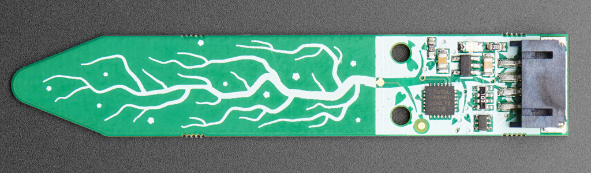

# 🌱 Eustaquia

Eustaquia is a playful project that lets a plant “talk” when it’s thirsty.
Using a [GRiSP2 board](https://www.grisp.org) running Erlang, it reads soil humidity and moves a face from happy 😀 to sad 😢 with a servo motor — a fun, beginner‑friendly way to explore GRiSP, embedded Erlang, and simple electronics.


## 🌀 How?


In words:

1. When the sensor is not inserted, the face is tilted down (sad).
2. When placed in the soil, it reads humidity every 5 seconds via I2C.
3. If humidity is above a threshold, Eustaquia smiles 😀.
4. If humidity is below the threshold, it stays sad 😢.

> ⚠️ The initial state looks just like the “sad” face. To verify that everything is working, dip the sensor in water and watch it change to happy.

## 🧠 Useful Concepts

- **I2C (Inter-Integrated Circuit)**: A protocol that lets components to exchange data using only two lines: SDA, for transmitting data and SCL, for providing the clock signal that synchronizes communication. Supported by GRiSP through its. It is supported by GRiSP via its [I2C library](https://hexdocs.pm/grisp/grisp_i2c.html). Used here to read soil moisture levels.

- **PWM (Pulse Width Modulation)**: A technique that regulates the power delivered to a device by rapidly switching the signal on and off. The duty cycle (percentage of time the signal is on) determines the output power—0% for fully off, 50% for half power, and 100% for fully on. Supported by GRiSP via its [PWM library](https://hexdocs.pm/grisp/grisp_pwm.html), making it ideal for controlling a servomotor to animate a sad face or a smile face.

## 🛠️ Components and how to connect them

### Components

To bring your plant project to life, you’ll need:

- 🟩 **[GRiSP2 embedded board](https://www.grisp.org/hardware)** – runs Erlang/Elixir directly on RTEMS, no Linux needed.
- 🔌 **USB cable (micro-USB)** – To power the board and access the console
- 💾 **microSD card** (optional) – For deploying your application. If your GRiSP board is already linked to [GRiSP.io](https://grisp.io/), you can deploy software updates remotely (OTA) without needing a microSD card or USB cable.
- 🪴 **Capacitive soil moisture sensor** – I used an [Adafruit Soil Moisture Sensor (I²C)](https://www.adafruit.com/product/4026) model; corrosion-proof and stable readings.
- ⚙️ **SG90 servo motor** (or similar) – To move Eustaquia’s face
- 🔌 [PMOD CON3: R/C Servo Connectors](https://digilent.com/shop/pmod-con3-r-c-servo-connectors/) – A small add-on board that lets you easily connect and control up to four servo motors.
- 🔋 **Power source** for the servo
- 🧵 **Jumper wires** – For connections.
- 🎨 **A face for Eustaquia** – Cardboard, 3D print, markers… get creative!

### How to connect them

#### Servo Motor

We want to connect a PMOD CON3, a battery and a servo:


To connect the servo, plug the PMOD R/C Servo module directly into the GRiSP board GPIO and attach the servo’s signal wire to the GPIO1_4 pin.

**How?**

🔋 Power and ground for the servo are provided through the PMOD connector, but since servos often need more current than the GRiSP board can safely supply, you should use a small external battery. The SG90 servo operating Voltage: 4.8V to 6V.

> ℹ️ Recommended: A small 5V battery pack (for example, 4x AA batteries = 6V, or a regulated USB 5V source).

To do this, connect the battery directly to the PMOD connector:

- Loosen the small screws on the PMOD’s power terminals (the blue block).
- Insert the battery wires into the terminals:
  - The negative wire (usually black) goes to the terminal marked “–”.
  - The positive wire (usually red) goes to the terminal marked “+”.
- Tighten the screws to secure the wires.

This setup allows the servo to receive enough power while still being controlled by the GRiSP board through the signal pin.

⚙️ To connect a servo to the PMOD R/C Servo (Pmod CON3), simply match the three wires of the servo to the corresponding pins on the PMOD:

- The signal wire (usually orange, yellow, or white) goes to SIG
- The power wire (red) goes to VS for voltage supply
- The ground wire (black or brown) connects to GND.

#### Soil moisture sensor

To connect the I²C soil moisture sensor, use a PMOD I²C module plugged into the GRiSP board and wire SCL to SCL, SDA to SDA, VCC to 3.3V or 5V (depending on the sensor), and GND to ground. The optional INT and RESET pins can be left unconnected.

**How?**



Looking at the PMOD R/C Servo (Pmod CON3) with the triangle marker pointing to the left, the pinout from top to bottom is:

- GND - power and logic ground
- VIN - 3-5V DC (use the same power voltage as you would for I2C logic)
- I2C SDA - there's a 10K pullup to VIN
- I2C SCL - there's a 10K pullup to VIN

More info at [Pinouts AdaFruit Stemma Soil Sensor](https://learn.adafruit.com/adafruit-stemma-soil-sensor-i2c-capacitive-moisture-sensor/pinouts).

Digilent Pmod Interface Specification that is updating the I2C spec to be 6-pin with:


- I2C SCL - signals on pin 3.
- I2C SDA - signals on pin 4.
- GND - Pin 5
- VIN - PIN 6
- Optional, interrupt and reset pins on 1 and 2 respectively.

Check the 1 marker on the board to know where is the pin 1.

More info at [PMOD I2C Spec](https://digilent.com/blog/new-i2c-standard-for-pmods/?srsltid=AfmBOoptLmLxP8FrLFza-cjVbrfgA9ECXlfR_V6dQ86XCC2ZdKUZdG3h).

## ⚙️ Build using a SD-Card

1. Compile the application locally: ``rebar3 compile``
2. Flash and deploy the application to a GRiSP device: `rebar3 grisp deploy`
3. Insert the SD card into the GRiSP board and power it up.

ℹ️ For more information on how this process works, check the [GRiSP wiki](https://github.com/grisp/grisp/wiki).

## 📦 Documentation

Generate documentation locally:

```sh
rebar3 ex_doc
open doc/index.html
```

## 🧪 Testing

You can manually test Eustaquia by connecting to the shell on the GRiSP board ([over a Serial](https://github.com/grisp/grisp/wiki/Connecting-over-Serial), for example) and running the provided test functions:

Inside the Erlang shell:

```erl
1> eustaquia:test_moisture().
%% → Reads the current soil moisture value once.

2> eustaquia:test_servo_happy().
%% → Moves the servo to the "happy" 😀 position.

3> eustaquia:test_servo_sad().
%% → Moves the servo to the "sad" 😢 position.
```

These commands let you verify that the sensor and servo are working correctly before running the full application loop.

## 🔮 Future Ideas

- 📱 **Notifications**: Send a message to your phone when Eustaquia is thirsty.
- 🌿 **Plant network**:  Imagine a “neighborhood watch” for plants — if one plant is thirsty 😢, nearby plants running on BEAM nodes can exchange messages to react in sympathy, creating a collective sadness that shows exactly where water is needed.
