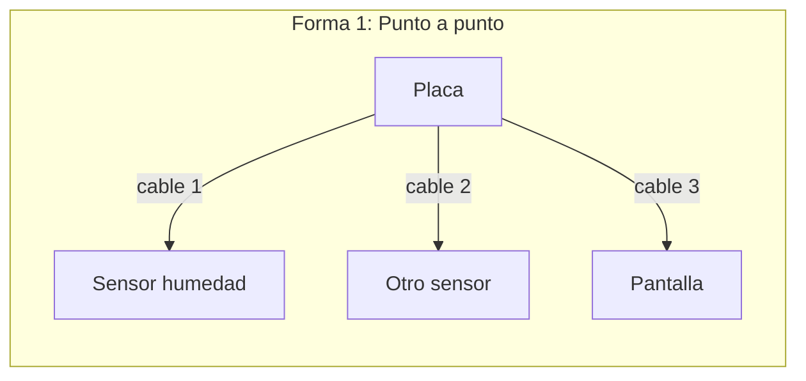
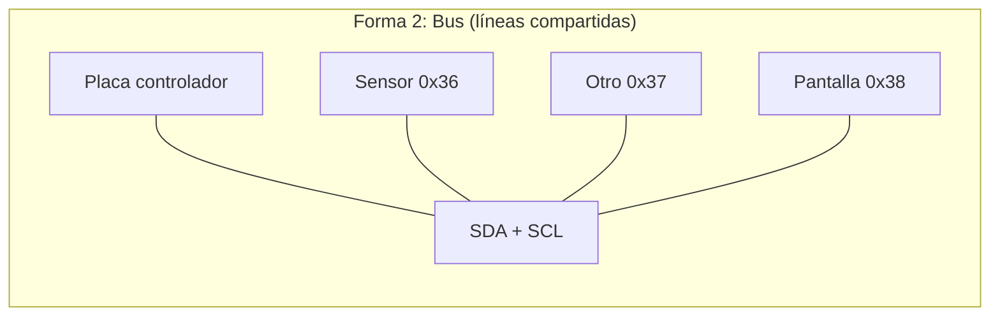
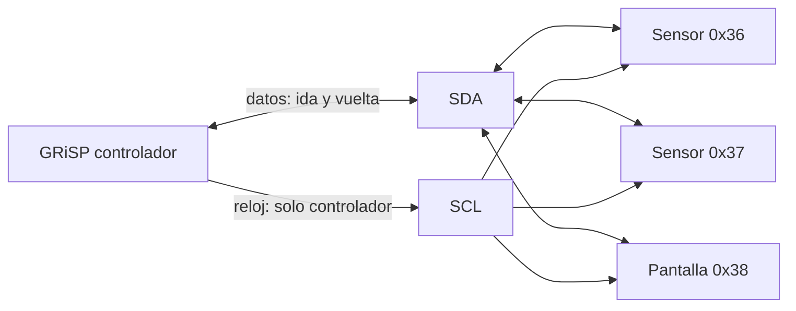
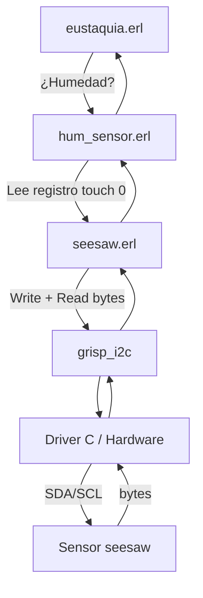

# Guía de implementación de Eustaquia (para principiantes)

Esta guía explica **qué hemos construido**, **qué es cada pieza** (hardware y software) y **por qué tomamos las decisiones** que tomamos. Está pensada para quien no ha tocado sensores, I²C ni placas embebidas: cada concepto se explica desde cero.

## Tabla de contenidos
- [1. ¿Qué es Eustaquia?](#1-que-es-eustaquia)
  - [1.1 Visión general paso a paso](#11-vision-general-paso-a-paso)
- [2. Conceptos de hardware (desde cero)](#2-conceptos-de-hardware-desde-cero)
  - [2.1 ¿Qué es un "bus" y de dónde viene la idea?](#21-que-es-un-bus-y-de-donde-viene-la-idea)
  - [2.2 Sensor de humedad: capacitivo vs resistivo](#22-sensor-de-humedad-capacitivo-vs-resistivo)
  - [2.3 ¿Qué es I²C?](#23-que-es-i2c)
  - [2.4 ¿Qué es PWM?](#24-que-es-pwm)
  - [2.5 ¿Qué es PMOD? ¿Qué es Digilent?](#25-que-es-pmod-que-es-digilent)
  - [2.6 Firmware](#26-firmware)
- [3. Librerías y dependencias](#3-librerias-y-dependencias)
  - [3.1 grisp](#31-grisp-dependencia-principal)
  - [3.3 timer](#33-timer-parte-de-erlangotp)
  - [3.4 rebar3 y Mix GRiSP](#34-rebar3-y-mix-grisp)
- [5. Características del sensor Adafruit](#5-caracteristicas-del-sensor-adafruit)
  - [5.1 Tipo de medida: capacitivo](#51-tipo-de-medida-capacitivo)
  - [5.2 Rango de lectura de humedad](#52-rango-de-lectura-de-humedad)
  - [5.5 Dirección I²C y protocolo](#55-direccion-i2c-y-protocolo)
  - [5.6 Chip interno y firmware Seesaw](#56-chip-interno-y-firmware-seesaw)
- [6. Características de la placa GRiSP](#6-caracteristicas-de-la-placa-grisp)
  - [6.1 API I²C: grisp_i2c](#61-api-i2c-grisp_i2c)
- [7. Capas de software](#7-capas-de-software)
  - [7.1 seesaw.erl y seesaw_device.erl](#71-seesaw-erl-y-seesaw_device-erl)
- [8. Cómo comprobar que todo funciona](#8-comprobar-que-todo-funciona)

### Cómo usar esta guía (paso a paso)

- **Si quieres ponerlo en marcha ya:** ve a [§8 Cómo comprobar que todo funciona](#8-comprobar-que-todo-funciona) y sigue los pasos en orden.
- **Si quieres entender el flujo completo:** después de leer §1 y §7, lee [§7 Capas de software](#7-capas-de-software).
- **Si empiezas de cero:** sigue el orden de la guía; la [§1.1 Visión general paso a paso](#11-vision-general-paso-a-paso) te da el mapa.

## 1. ¿Qué es Eustaquia?

Eustaquia es un proyecto en el que una planta "muestra" si tiene sed:

- Un **sensor** enterrado en la tierra mide la humedad.
- Una **placa GRiSP** (que ejecuta Erlang) lee ese sensor y decide.
- Un **servo** mueve una carita: 😀 si hay humedad, 😢 si está seca.

Todo el código de lógica y de protocolo está en **Erlang**.

### 1.1 Visión general paso a paso

Para tener claro el camino de punta a punta:

1. **Entender qué hace Eustaquia** (este apartado): sensor → humedad, placa → decisión, servo → carita.
2. **Conceptos de hardware** (§2): bus, I²C, sensor capacitivo, PMOD; así sabes con qué cables y chips trabajas.
3. **Dependencias y fuentes** (§3): qué librerías usa el proyecto y de dónde salen registros, delays y umbrales.
4. **Capas de software** (§7): qué módulo llama a qué (eustaquia → hum_sensor → seesaw → grisp_i2c) y qué hace cada uno.
5. **Comprobar que funciona** (§8): conectar, compilar, flashear, abrir consola y ejecutar los comandos de prueba en orden.

Cuando quieras profundizar en “qué ocurre exactamente al leer humedad”, revisa §7 (capas de software) y el código en `hum_sensor.erl` y `seesaw.erl`.

## 2. Conceptos de hardware (desde cero)

### 2.1 ¿Qué es un "bus" y de dónde viene la idea?

Imagina que tienes una **placa** (por ejemplo la GRiSP) y quieres conectar **varios dispositivos**: un sensor de humedad, otro sensor, una pantalla… Todos tienen que poder hablar con la placa. Hay dos formas de hacerlo.

---

**Forma 1: Conexión punto a punto (sin bus)**

Cada dispositivo tiene **sus propios cables** que lo unen solo con la placa. Esos cables no los usa nadie más.

- Cable 1 (por ejemplo dos hilos: datos y reloj) → de la placa al **sensor de humedad**.
- Cable 2 → de la placa al **segundo sensor**.
- Cable 3 → de la placa a la **pantalla**.

Cada enlace es **exclusivo**: el sensor de humedad y la pantalla no comparten ningún cable. La placa tiene que tener **un puerto o un par de pines distinto** para cada dispositivo. 

Ventaja: no hace falta ninguna regla de "a quién me dirijo"; cada cable va a un solo sitio. 

Desventaja: **cuantos más dispositivos, más cables y más pines**. Si mañana quieres añadir un cuarto dispositivo, necesitas más pines libres en la placa y más cable. 

En la práctica, las placas no tienen infinitos pines, así que con muchos periféricos este enfoque se vuelve incómodo o imposible.

---

**Forma 2: Bus (líneas compartidas)**

Todos los dispositivos se conectan a **los mismos cables**. Todos "escuchan" por las mismas líneas.

Entonces, ¿cómo sabe la placa o el PC con quién está hablando en cada momento? Porque existe una **regla**: antes de enviar datos, la placa (que aquí hace de **controlador**) envía la **dirección** del dispositivo al que se dirige (un número, por ejemplo 0x36 para nuestro sensor). Solo el dispositivo con esa dirección responde; los demás ignoran el mensaje. Es como una calle con muchas casas: el cartero anuncia "casa 54" y solo esa casa abre la puerta.

Así, con **solo dos líneas de datos** (más alimentación y tierra) puedes tener muchos dispositivos. Añadir uno nuevo es conectar sus patas a las mismas líneas; no hace falta más pines en la placa, como podéis ver en la imagen 1. 

**Resumen**

| Criterio | Punto a punto | Bus |
|----------|----------------|-------------------|
| Cables de datos | Un juego por cada dispositivo | Un solo juego compartido |
| Pines en la placa | Más dispositivos = más pines | Los mismos pines para todos |
| Identificación | No hace falta (cada cable va a un sitio) | Direcciones (el controlador dice "hablo con 0x36") |
| Añadir dispositivo | Hace falta más cable y más pines | Se conecta a las mismas líneas |

**Ejemplos de buses**:

- **USB (Universal Serial Bus):** Es un estándar de bus definido por cables, conectores y un protocolo para conectar periféricos a un host (por ejemplo tu PC) y transmitir datos y, a menudo, alimentación. Es **serial** porque los datos viajan en serie (bit a bit por el mismo par de líneas D+ y D−). El conector típico tiene **cuatro contactos** (las láminas doradas que se ven dentro del enchufe): **VBUS** (+5 V de alimentación), **D−** y **D+** (las dos líneas de datos) y **GND** (tierra). 
<figure>
  
  <figcaption>Imagen 1: USB as a bus example</figcaption>
</figure>

- **Bus I²C:** Bus serial con **dos líneas de datos** compartidas —**SDA** (datos) y **SCL** (reloj)— más alimentación y tierra. Como varios dispositivos se van a conectar a las mismas SDA y SCL, necesitan **un controlador** (maestro) que inicia siempre la comunicación y genera la señal de reloj en SCL; los demás son **dispositivos** (esclavos). Cada dispositivo tiene una **dirección** fija de 7 bits (p. ej. 0x36, 0x37). En cada transacción el controlador envía primero esa dirección; **solo** el dispositivo con esa dirección responde; los otros ignoran el mensaje. Para más información revisar la [sección 2.3](#23-que-es-i2c).

<figure>
  
  <figcaption>Imagen 2: Bus I2C example</figcaption>
</figure>

¿Cómo se conectan varios dispositivos o sensores al mismo bus? Hay varias opciones: 
- **(1)** Usar una **protoboard**: sacar las líneas del bus desde el conector de la placa a las tiras de conexión y enchufar ahí cada dispositivo.
- **(2)** Usar un **cable en Y** o **splitter**: un cable que se divide en dos o más extremos con las mismas líneas, para conectar varios dispositivos sin protoboard. Como podemos ver en la imagen 3.
<figure>
  
  <figcaption>Imagen 3: Splitter USB</figcaption>
</figure>

- **(3)** **Pass-through (“en cadena”)**: muchos módulos de expansión traen un **segundo conector** que repite las señales del bus (daisy chaining). Enchufas un módulo en la placa y otro en ese segundo conector; ambos comparten el mismo bus (cada uno con su dirección). Como podéis ver en la imagen 4.

<figure>
  
  <figcaption>
  Imagen 4: Pmod HYGRO (Sensor de humedad en aire y temperatura) por I²C (chip HDC1080) con daisy chaining. Tiene un segundo conector PMOD que repite el bus (pass-through).
  </figcaption>
</figure>

### 2.2 Sensor de humedad: capacitivo vs resistivo

Hay dos formas típicas de medir humedad en tierra:

| Tipo | Idea | Problema |
|------|------|----------|
| **Resistivo** | Dos puntas de metal en la tierra; se mide la resistencia entre ellas. El agua conduce la electricidad, así que más humedad = menos resistencia. | El metal se **oxida** en contacto con la tierra y la humedad; la medida se desvía y hay que recalibrar a menudo. |
| **Capacitivo** | Se mide la **capacidad** (cómo de "cargable" es la zona alrededor del sensor). La humedad cambia esa capacidad. | No hay metal expuesto a la tierra; no se oxida. Medidas más estables. |

Nosotros usamos un sensor **capacitivo**. No introduce corriente continua en la tierra ni tiene puntas metálicas expuestas, así que es más adecuado para plantas a largo plazo.

### 2.3 ¿Qué es I²C?

**I²C** (Inter-Integrated Circuit) es un **protocolo de comunicación**: unas reglas que definen cómo varios chips envían y reciben datos por un bus compartido. I²C se compone de un cable de alimentación, otro cable de tierra, y otros dos de datos: 
  - **SDA** (Serial Data): por donde viajan los datos.
  - **SCL** (Serial Clock): la señal de reloj que marca cuándo leer cada bit.

Un chip actúa como **controlador** (maestro): inicia las conversaciones y genera el reloj. En nuestro caso es la **GRiSP**. Los demás son **objetivos** (esclavos): solo responden cuando el controlador los llama por su **dirección** (un número de 7 bits, por ejemplo 0x36). Varios sensores pueden estar en el mismo bus; cada uno tiene una dirección distinta.

La comunicación en el bus es **secuencial**: en cada momento solo hay una transacción. El estándar I²C permite hasta **128 direcciones** (0x00–0x7F) en un mismo bus; cuantos más dispositivos estén conectados, más turnos y mayor carga de trabajo para el controlador.

Vamos a fijarnos y entender cómo trabaja este protocolo con sus dos líneas de datos, muy similar a cómo funciona una partitura de música, siendo SCL el metrónomo y SDA la partitura. A continuación se describe qué hace cada línea, en qué instante se considera válido un bit (0 o 1) y los pasos de una transacción típica.

<figure>
  
  <figcaption>Imagen 5: SCL + SDA</figcaption>
</figure>

Como se ve en la **Imagen 5**, **SCL** (Serial Clock) es la señal eléctrica en rojo: el controlador genera los pulsos y cada uno marca el instante en que se lee o se escribe **un bit** en **SDA** (Serial Data), la línea en verde por donde viajan los datos. 

Para saber si ese bit del SDA es 0 o 1 hay una regla fija: **se lee la línea verde (SDA) cuando la roja (SCL) está en nivel alto**; en ese momento el valor es estable (bajo = 0, alto = 1). Cuando SCL está en bajo, el dispositivo puede cambiar el valor en SDA; por eso se muestrea SDA justo cuando SCL está en alto, cuando el valor ya es estable.

Una transacción típica sigue estos pasos: 

- **(1) Condición de inicio:** el controlador indica que empieza una nueva conversación (por ejemplo, baja SDA mientras SCL está alto).
- **(2) Dirección:** envía **8 bits** por SDA (7 bits de dirección del dispositivo más 1 de lectura/escritura), **un bit por cada pulso** de SCL; así el receptor sabe “a quién” se dirige.
- **(3) ACK:** solo el dispositivo cuya dirección coincida responde con un bit de confirmación (ACK) en el siguiente pulso; el resto no hace nada. 
- **(4) Datos:** a continuación van uno o más **bytes de 8 bits**, cada bit al ritmo de SCL, ya sea del controlador al dispositivo o al revés. 
- **(5) Parada:** el controlador termina la transacción con una condición de parada.

> *Como recurso opcional, puedes ver una simulación de señal de reloj y datos en [Falstad – circuito con reloj y flip-flop](https://www.falstad.com/circuit/e-clockedsrff.html). Ignora las puertas lógicas de arriba y fíjate en la parte inferior: cómo la señal de reloj (similar a SCL) marca los instantes y la otra señal (similar a SDA) lleva el dato en cada pulso. Sirve para intuir la relación “reloj + dato” que hemos descrito para SDA y SCL.*

En resumen: I²C = protocolo para hablar con varios chips con solo 2 cables (más alimentación y tierra), usando direcciones para saber con quién se habla.

### 2.4 ¿Qué es PWM?

**PWM (Modulación por ancho de pulso)** es una técnica para controlar la “cantidad” de algo (luz, velocidad de un motor, posición de un servo) sin variar el voltaje de alimentación.

Como podemos ver en la imagen 6, se envía una señal que **alterna entre encendido y apagado** de forma periódica. Esa señal son **pulsos**: durante un tiempo la tensión está en alto (p. ej. 3,3 V) y durante otro en bajo (0 V). Lo que se regula no es el voltaje, sino **cuánto tiempo** está en alto frente al tiempo total del ciclo: el **ciclo de trabajo** (duty cycle), es decir, el porcentaje del periodo en que la señal está en alto. A más ciclo de trabajo, más “efecto” (más brillo en un LED, más velocidad en un motor DC o, en un servo, otra posición del eje).

<figure>
  
  <figcaption>Imagen 6: PWM — relación entre periodo, ancho de pulso y ciclo de trabajo.</figcaption>
</figure>

**Frecuencia y ancho del pulso.** La **frecuencia** es cuántas veces por segundo se repite el ciclo (p. ej. 50 Hz = 50 ciclos por segundo). Suele fijarse según el dispositivo. Lo que se **modula** (se cambia) es el **ancho del pulso**: cuántos microsegundos o milisegundos está la señal en alto en cada ciclo. En un servo típico, el ancho del pulso indica la posición: por ejemplo 1 ms = un extremo, 1,5 ms = centro, 2 ms = el otro extremo, siempre con periodo estable (p. ej. 20 ms a 50 Hz).

**En Eustaquia:** Usamos PWM para el **servo** que mueve la carita. La placa genera una señal a ~50 Hz y cambia el ancho del pulso para elegir la posición: un ancho para “feliz” y otro para “triste”. Quien genera esa señal es el driver que usa el módulo `grisp_pwm`.

### 2.5 ¿Qué es PMOD? ¿Qué es Digilent?

**PMOD (peripheral module)** es un estándar de módulos de expansión creado por **Digilent**. Son plaquitas pequeñas y de bajo coste que, junto con sus **conectores** y el **puerto PMOD host** de la placa, permiten conectar periféricos sin soldar. 

Las partes principales son: 
- **(1) Puerto host:** el conector en la placa (p. ej. GRiSP) que expone alimentación, tierra y las líneas del protocolo (I²C, SPI, etc.). 
- **(2) Módulo PMOD:** la plaquita con el sensor, pantalla o circuito; en un lado tiene el conector que se enchufa en el host (o en otro módulo). Puede verse en la siguiente imagen 7.

<figure>
  
  
  <figcaption>Imagen 7: Ejemplo de módulos PMOD: Pmod HYGRO (humedad/temperatura) y Pmod COLOR.</figcaption>
</figure>

- **(3) Puerto pass-through (daisy chaining):** muchos módulos llevan un **segundo conector** que repite las mismas señales del host. Así puedes enchufar un primer PMOD en la placa y un **segundo** PMOD en ese segundo conector del primero; ambos comparten el mismo bus. La utilidad del chaining es conectar **varios dispositivos** usando un solo puerto host: la placa solo tiene un conector ocupado y los módulos quedan “en cadena” (daisy chain), todos en el mismo bus I²C (o SPI), cada uno con su dirección. Como se ve en la imagen 8.

<figure>
  
  <figcaption>Imagen 8: Conexión desde el puerto PMOD host de la placa a dos módulos PMOD: el Pmod HYGRO en daisy chaining con el Pmod COLOR.</figcaption>
</figure>

Según su función, cada módulo implementa un **protocolo concreto** (I²C, SPI, UART, etc.). 

**¿Qué pasa si no tienes un módulo PMOD?**

El **puerto PMOD host** de la placa sigue siendo usable: expone las señales de la placa (alimentación, tierra, SDA, SCL, etc.) en un conector estándar. Si no tienes un módulo PMOD, puedes usar ese puerto con otros dispositivos siempre que adaptes el cableado (el conector puede ser más frágil y los pines, fáciles de dañar).

Un ejemplo es conectar el **sensor de humedad Adafruit** (STEMMA Soil Sensor) al **módulo PMOD I²C** de Digilent, pin a pin, uniendo el VIN, GND, SDA y SCL del sensor a los del PMOD. Esta información la podemos encontrar en la documentación de ambos: [Adafruit (sensor de humedad)](https://learn.adafruit.com/adafruit-stemma-soil-sensor-i2c-capacitive-moisture-sensor/pinouts) y de [Digilent (PMOD I²C)](https://digilent.com/blog/new-i2c-standard-for-pmods/). La imagen 9 muestra el resultado; la tabla 1 indica la correspondencia de pines (los que comparten señal han de ir conectados entre sí).

<figure>
  
  <figcaption>Imagen 9: Sensor Adafruit Soil (humedad) conectado al PMOD I²C.</figcaption>
</figure>

| Pin PMOD | Señal PMOD I²C (Digilent) | Señal Adafruit Soil | Pin Adafruit |
|----------|----------------------------|---------------------|--------------|
| 1        | RST (reset)                | —                   | —            |
| 2        | INT (interrupt)            | —                   | —            |
| 3        | SCL                        | SCL                 | 4            |
| 4        | SDA                        | SDA                 | 3            |
| 5        | GND                        | GND                 | 1            |
| 6        | VCC (3,3 V o 5 V)          | VIN                 | 2            |

*Tabla 1: Correspondencia de pines PMOD I²C (Digilent) y sensor de humedad Adafruit (STEMMA Soil).*

### 2.6 Firmware

Firmware es el software que va dentro del dispositivo y que se guarda en memoria no volátil (ROM, flash, microSD): al encender el aparato, el procesador arranca ejecutando ese código. No es “un programa que abres en el PC”, sino la imagen (sistema + aplicaciones) que se graba en el hardware y que este ejecuta cada vez que se enciende. Ejemplos: el firmware del router, del sensor, de la GRiSP o de un reloj inteligente.

## 3. Librerías y dependencias: por qué se necesitan y qué hacen

El proyecto depende de unas pocas librerías. Aquí se explica **para qué sirve cada una** y **qué función tiene** en Eustaquia.

### 3.1 grisp (dependencia principal)

**Qué es:** La librería y runtime de [GRiSP](https://www.grisp.org): permite compilar, flashear y ejecutar Erlang/OTP en la placa GRiSP (sobre RTEMS). Incluye los **drivers** (en C) y las **APIs en Erlang** para hablar con el hardware. *(Los **drivers** son programas que acceden directamente al hardware: leen y escriben registros del chip, configuran pines, manejan interrupciones. Suelen estar en C porque deben tocar memoria y periféricos a bajo nivel. GRiSP trae ya los drivers de I²C, PWM, etc.; desde Erlang solo usas la API que llama a ese código.)*

**Por qué la necesitamos:** Necesitamos el código que ya trae GRiSP para acceder al hardware.

**Qué usamos de ella:**

| Módulo / API | Función | Dónde la usamos |
|--------------|---------|------------------|
| **grisp_i2c** | Abre un bus I²C (`open/1`), envía y recibe mensajes (`transfer/2`), opcionalmente detecta dispositivos (`detect/1`). Por debajo llama al driver I²C en C. | `seesaw.erl`, `seesaw_device.erl`: todo el diálogo con el sensor (escribir dirección de registro, leer bytes). |
| **grisp_pwm** | Inicia el driver PWM (`start_driver/0`), abre un pin en modo PWM (`open/3`), ajusta el ciclo de trabajo (`set_sample/2`), cierra el pin (`close/1`). El servo se controla con una señal PWM a ~50 Hz. | `servo_emo.erl`: mover la carita (happy = un duty cycle, sad = otro). |

*Tabla 2: Módulos de GRiSP que usaremos en el proyecto.*

**Resumen:** `grisp` nos da el **acceso al hardware** (I²C y PWM). Nosotros no implementamos ese acceso; solo lo usamos desde Erlang y encima implementamos el **protocolo** del sensor (seesaw) y la **lógica** de la aplicación (Eustaquia).

### 3.3 timer (parte de Erlang/OTP)

**Qué es:** El módulo `timer` forma parte de la **biblioteca estándar de Erlang/OTP** (no es una dependencia externa). Proporciona `timer:sleep(Millisec)` y otras utilidades de tiempo.

**Por qué lo necesitamos:** El protocolo seesaw (y el código de referencia en Arduino) requiere **esperar un poco** después de pedir un registro antes de leer la respuesta (el chip tarda en hacer la medida). Nosotros usamos `timer:sleep(DelayMs)` en `seesaw.erl` para ese delay (por ejemplo 10 ms para humedad, 100 ms para temperatura).

**Función:** Pausar el proceso actual X milisegundos sin bloquear el resto del sistema.

### 3.4 rebar3 y Mix GRiSP

- **rebar3 grisp** es el plugin de rebar3 para GRiSP (herramienta de build para proyectos Erlang) que integra el flujo de GRiSP: además de compilar, permite **generar el firmware** (imagen que se escribe en la GRiSP, con el sistema RTEMS, runtime Erlang/OTP y tu app empaquetada) y **flashearlo** en la placa (p. ej. `rebar3 grisp deploy` o `rebar3 grisp burn`); con `rebar3 grisp deploy` se construye esa imagen y se graba en la microSD (o por el método que uses), y la placa la ejecuta al bootear.

- **Mix GRiSP** es el equivalente en el ecosistema **Elixir**: Mix es la herramienta de build de Elixir (como rebar3 para Erlang); el proyecto o las tareas GRiSP para Mix permiten compilar y desplegar firmware en la placa desde un proyecto Elixir. 

## 5. Características del sensor Adafruit (explicadas)

Usamos el **[Adafruit STEMMA Soil Sensor - I²C Capacitive Moisture Sensor](https://www.adafruit.com/product/4026)** (conector JST-PH 2 mm). En esta sección se resumen sus características en lenguaje sencillo.

| Característica | Valor / descripción |
|----------------|---------------------|
| Tipo | Capacitivo (una sonda, sin metal expuesto) |
| Rango humedad | ~200 (seco) a ~2000 (húmedo) |
| Temperatura | Interna, ~±2 °C |
| Alimentación | 3–5 V DC |
| Comunicación | I²C, dirección 0x36 por defecto |
| Protocolo sobre I²C | Seesaw (registros de 2 bytes) |
| Conector | 4 pines JST-PH (VIN, GND, SDA, SCL) |

### 5.1 Tipo de medida: capacitivo

Mide la humedad por **capacidad**, no por resistencia entre dos puntas. Una sola sonda, sin metal expuesto a la tierra; no se oxida y no inyecta corriente continua en el sustrato. Ideal para uso continuo con plantas.

### 5.2 Rango de lectura de humedad

- **Valores típicos:** Aproximadamente **200 (muy seco)** a **2000 (muy húmedo)**. Valores intermedios dependen del tipo de tierra y de cómo esté enterrado el sensor.

### 5.5 Dirección I²C y protocolo

- **Dirección por defecto:** 0x36 (en decimal, 54). Es la que usa nuestro código.
- **Protocolo:** El sensor no habla "I²C genérico", sino un protocolo concreto llamado **seesaw**: cada magnitud (humedad, temperatura) está en un **registro** identificado por **dos bytes** (módulo + registro). Por eso nuestro código envía 2 bytes para indicar "quiero este registro" y luego lee la respuesta.

### 5.6 Chip interno y firmware Seesaw: quién implementa qué

Dentro del Adafruit STEMMA Soil Sensor hay un microcontrolador de la familia **ATSAMD09 / ATSAMD10** (ARM Cortex-M0+). En ese chip corre el **firmware Seesaw** (código abierto, [adafruit/seesaw](https://github.com/adafruit/seesaw)): es el que maneja el mapa de registros, hace la medida capacitiva (touch/ADC), lee el termómetro interno y responde por I²C cuando la GRiSP le pide datos.

**No tenemos que implementar ese firmware** — ya viene en el sensor. Lo que sí implementamos es el **lado host del protocolo** en Erlang (`seesaw.erl`): qué bytes enviar para pedir cada registro, cuándo esperar antes de leer y cómo interpretar la respuesta (p. ej. 2 bytes → humedad; 4 bytes → temperatura como fixed-point). Resumen: el chip del sensor = firmware Seesaw (ya está); la GRiSP = cliente del protocolo (nuestro código).

Los detalles de implementación (registros 0x0F/0x10 y 0x00/0x04, fórmula de temperatura raw/65536, delays y reintentos, uso de `grisp_i2c:transfer`) están **documentados en el código** en `hum_sensor.erl` y `seesaw.erl` (atributos `-doc` y comentarios); las fuentes originales (RegisterMap.h, Arduino, etc.) están citadas en el proyecto.

## 6. Características de la placa GRiSP (explicadas)

La **[GRiSP](https://www.grisp.org)** es una placa que ejecuta **Erlang/OTP** directamente sobre un sistema en tiempo real (**RTEMS**), sin Linux; así se pueden programar sensores y actuadores en Erlang en lugar de C o del ecosistema Arduino.

A modo de resumen:

| Característica | Descripción |
|----------------|-------------|
| Sistema | RTEMS + Erlang/OTP (sin Linux) |
| I²C | Dos buses: i2c0 (interno), i2c1 (externo). Nosotros usamos i2c1. |
| API I²C | `grisp_i2c`: open, transfer, read, write, detect. |
| Driver I²C | Implementado en C en el runtime; desde Erlang solo se usa la API. |
| Conectores | PMOD (y otros); usamos PMOD I²C para el sensor. |

### 6.1 API I²C: grisp_i2c

La comunicación I²C desde Erlang se hace con el módulo **[grisp_i2c](https://hexdocs.pm/grisp/grisp_i2c.html)**:

- **`open(Nombre)`** – Abre un bus (por ejemplo `i2c1`) y devuelve una referencia para usarla en el resto de llamadas.
- **`transfer(Bus, Mensajes)`** – Envía una lista de operaciones: escrituras (bytes a un dispositivo) o lecturas (cuántos bytes leer de un dispositivo). Cada mensaje lleva la **dirección** del chip (1–127) y los datos o la longitud.
- **`read(Bus, Dirección, Registro, Longitud)`** / **`write(...)`** – Atajos para chips que usan **un solo byte** de dirección de registro. Nuestro sensor usa **dos bytes** (protocolo seesaw), por eso usamos **`transfer`** y no estos atajos.

El "driver" real (el código que toca el hardware I²C) está en **C** dentro del runtime de GRiSP; nosotros solo usamos la API Erlang.

## 7. Capas de software (quién hace qué)

En resumen, cada capa hace lo siguiente:

- **grisp_i2c:** API Erlang que ya viene con GRiSP. Abre el bus y envía/recibe mensajes (write/read). El driver real (acceso al hardware) está en C debajo.
- **seesaw.erl:** Implementa el **protocolo** seesaw en Erlang: "para leer este registro envío estos 2 bytes y leo N bytes". Usa solo `grisp_i2c` (open + transfer).
- **hum_sensor.erl:** Sabe qué registros son humedad y temperatura; aplica delays y reintentos (como en Arduino) y devuelve valores útiles (humedad 0–65535, temperatura en °C).
- **eustaquia.erl:** Lógica de la planta: cada X segundos lee humedad, compara con un umbral y mueve el servo (carita feliz/triste).

### 7.1 seesaw.erl y seesaw_device.erl: qué es cada uno

Hay **dos módulos** con nombres parecidos; hacen cosas distintas:

| Módulo | Qué es | Para qué sirve |
|--------|--------|----------------|
| **seesaw** | Implementación del **protocolo** seesaw en Erlang. Son funciones puras: “dame bus + dirección + registro + longitud (y opcionalmente un delay), y yo hablo por I²C y te devuelvo los bytes”. Cada llamada a `seesaw:read(...)` o `seesaw:write(...)` hace su propia apertura del bus y su transferencia. | Leer o escribir cualquier registro de cualquier dispositivo seesaw (humedad, temperatura, etc.). Es la capa que usa `hum_sensor` por debajo. No guarda estado; no serializa. |
| **seesaw_device** | Un **proceso** (gen_server) que representa “un dispositivo seesaw en un bus y dirección concretos”. Mantiene abierto el bus, recibe peticiones de lectura/escritura y las ejecuta **una detrás de otra** (en serie). | Útil cuando **varios procesos** en tu aplicación quieren usar el mismo sensor a la vez: en lugar de que cada uno llame a `seesaw:read(...)` por su cuenta (y se puedan mezclar mensajes I²C), todos le piden al mismo proceso `seesaw_device` y ese proceso hace una operación cada vez. |

**Resumen:** `seesaw` = “el protocolo” (cómo hablar con un chip seesaw por I²C). `seesaw_device` = “un proceso que usa ese protocolo y serializa los accesos” para un solo bus+dirección. En Eustaquia solo un proceso (el bucle de humedad) toca el sensor, así que usamos **solo seesaw** (desde `hum_sensor`). Si más adelante añades otro proceso que también lea el sensor, podrías arrancar un `seesaw_device` y que ambos hablen con el sensor a través de ese proceso.

## 8. Cómo comprobar que todo funciona (paso a paso)

Para los pasos concretos (conectar hardware, compilar, flashear la placa, abrir consola y ejecutar las pruebas), consulta el **[README](../README.md)** del proyecto: ahí están los comandos y la sección de *Testing* con las llamadas para comprobar el sensor y el servo.