# Eustaquia implementation guide (for beginners)

This guide explains **what we built**, **what each part is** (hardware and software), and **why we made the decisions** we did. It is aimed at anyone new to sensors, I²C, or embedded boards: every concept is explained from scratch.

## Table of contents
- [1. What is Eustaquia?](#1-what-is-eustaquia)
  - [1.1 Step-by-step overview](#11-step-by-step-overview)
- [2. Hardware concepts (from scratch)](#2-hardware-concepts-from-scratch)
  - [2.1 What is a "bus" and where does the idea come from?](#21-what-is-a-bus-and-where-does-the-idea-come-from)
  - [2.2 Moisture sensor: capacitive vs resistive](#22-moisture-sensor-capacitive-vs-resistive)
  - [2.3 What is I²C?](#23-what-is-i2c)
  - [2.4 What is PWM?](#24-what-is-pwm)
  - [2.5 What is PMOD? What is Digilent?](#25-what-is-pmod-what-is-digilent)
  - [2.6 Firmware](#26-firmware)
- [3. Libraries and dependencies](#3-libraries-and-dependencies)
  - [3.1 grisp](#31-grisp-main-dependency)
  - [3.3 timer](#33-timer-part-of-erlangotp)
  - [3.4 rebar3 and Mix GRiSP](#34-rebar3-and-mix-grisp)
- [5. Adafruit sensor characteristics](#5-adafruit-sensor-characteristics)
  - [5.1 Measurement type: capacitive](#51-measurement-type-capacitive)
  - [5.2 Moisture reading range](#52-moisture-reading-range)
  - [5.5 I²C address and protocol](#55-i2c-address-and-protocol)
  - [5.6 Internal chip and Seesaw firmware](#56-internal-chip-and-seesaw-firmware)
- [6. GRiSP board characteristics](#6-grisp-board-characteristics)
  - [6.1 I²C API: grisp_i2c](#61-i2c-api-grisp_i2c)
- [7. Software layers (who does what)](#7-software-layers-who-does-what)
  - [7.1 seesaw.erl and seesaw_device.erl](#71-seesaw-erl-and-seesaw_device-erl)
- [8. How to verify everything works](#8-how-to-verify-everything-works)

### How to use this guide (step by step)

- **If you want to get it running now:** go to [§8 How to verify everything works](#8-how-to-verify-everything-works) and follow the steps in order.
- **If you want to understand the full flow:** after reading §1 and §7, read [§7 Software layers](#7-software-layers-who-does-what).
- **If you are starting from zero:** follow the guide in order; [§1.1 Step-by-step overview](#11-step-by-step-overview) gives you the map.

## 1. What is Eustaquia?

Eustaquia is a project where a plant "shows" when it is thirsty:

- A **sensor** in the soil measures moisture.
- A **GRiSP board** (running Erlang) reads that sensor and decides.
- A **servo** moves a face: 😀 when there is enough moisture, 😢 when it is dry.

All the logic and protocol code is in **Erlang**.

### 1.1 Step-by-step overview

To see the path from start to finish:

1. **Understand what Eustaquia does** (this section): sensor → moisture, board → decision, servo → face.
2. **Hardware concepts** (§2): bus, I²C, capacitive sensor, PMOD; so you know what cables and chips you are dealing with.
3. **Dependencies** (§3): which libraries the project uses and where registers, delays, and thresholds come from.
4. **Software layers** (§7): which module calls which (eustaquia → hum_sensor → seesaw → grisp_i2c) and what each does.
5. **Verify it works** (§8): connect, compile, flash, open the console, and run the test commands in order.

When you want to dig into "what exactly happens when we read moisture", see §7 (software layers) and the code in `hum_sensor.erl` and `seesaw.erl`.

---

## 2. Hardware concepts (from scratch)

### 2.1 What is a "bus" and where does the idea come from?

Imagine you have a **board** (e.g. the GRiSP) and you want to connect **several devices**: a moisture sensor, another sensor, a display. They all need to talk to the board. There are two ways to do it.

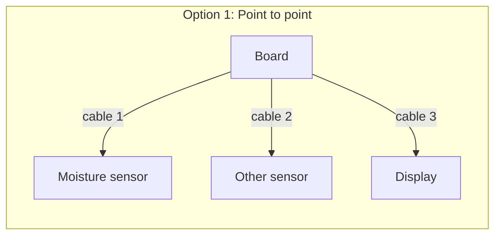

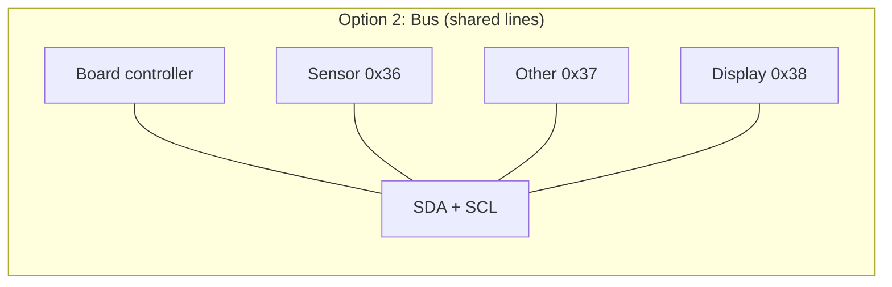

---

**Option 1: Point-to-point (no bus)**

Each device has **its own cables** to the board. No one else uses those cables.

- Cable 1 (e.g. two wires: data and clock) → from the board to the **moisture sensor**.
- Cable 2 → from the board to the **second sensor**.
- Cable 3 → from the board to the **display**.

Each link is **exclusive**: the moisture sensor and the display do not share any cable. The board must have **a distinct port or pair of pins** for each device.

Advantage: no need for "who am I talking to" rules; each cable goes to one place.

Disadvantage: **more devices mean more cables and more pins**. To add another device tomorrow, you need more free pins on the board and more wire.

In practice, boards do not have infinitely many pins, so with many peripherals this approach becomes awkward or impossible.

---

**Option 2: Bus (shared lines)**

All devices connect to **the same wires**. They all "listen" on the same lines.

So how does the board or PC know who it is talking to at any moment? Because of a **rule**: before sending data, the board (the **controller**) sends the **address** of the device it is targeting (a number, e.g. 0x36 for our sensor). Only that device replies; the others ignore the message. Like a street with many houses: the mail carrier says "house 54" and only that house opens the door.

So with **just two data lines** (plus power and ground) you can have many devices. Adding a new one means connecting its pins to the same lines; you do not need more pins on the board, as you can see in image 1.

**Summary**

| Criterion | Point to point | Bus |
|-----------|----------------|-----|
| Data cables | One set per device | One shared set |
| Board pins | More devices = more pins | Same pins for all |
| Identification | Not needed (each cable goes to one place) | Addresses (controller says "talking to 0x36") |
| Adding a device | More cable and more pins | Connect to the same lines |

**Examples of buses**

- **USB (Universal Serial Bus):** A bus standard defined by cables, connectors, and a protocol to connect peripherals to a host (e.g. your PC) and carry data and often power. It is **serial** because data travels one bit at a time on the same pair of lines D+ and D−. The typical connector has **four contacts** (the gold strips inside the plug): **VBUS** (+5 V), **D−** and **D+** (data), and **GND** (ground).
<figure>
  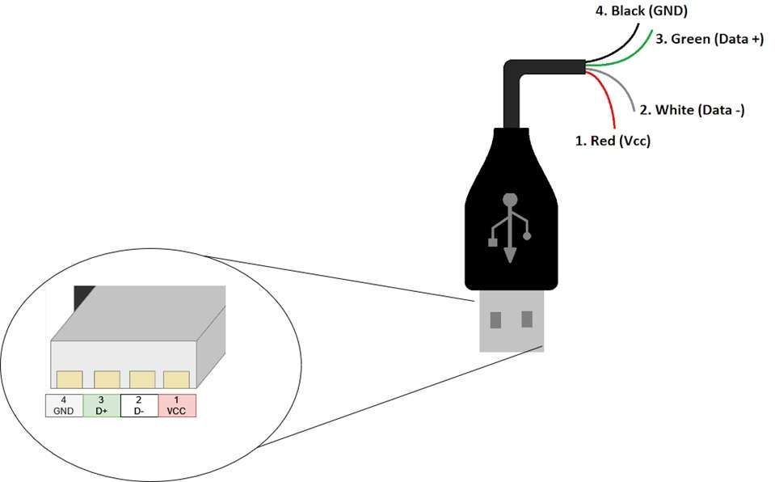
  <figcaption>Image 1: USB as a bus example</figcaption>
</figure>

- **I²C bus:** Serial bus with **two shared data lines** — **SDA** (data) and **SCL** (clock) — plus power and ground. Because several devices share SDA and SCL, there must be **one controller** (master) that always starts communication and drives the clock on SCL; the others are **devices** (slaves). Each device has a fixed 7-bit **address** (e.g. 0x36, 0x37). In each transaction the controller sends that address first; **only** the device with that address replies; the others ignore the message. For more detail see [section 2.3](#23-what-is-i2c).

<figure>
  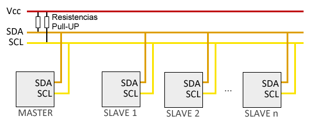
  <figcaption>Image 2: I²C bus example</figcaption>
</figure>

How do you connect several devices or sensors to the same bus? Options include:
- **(1)** Use a **breadboard**: run the bus lines from the board connector to the breadboard strips and plug each device there.
- **(2)** Use a **Y cable** or **splitter**: one cable that splits into two or more ends with the same lines, to connect several devices without a breadboard. As in image 3.
<figure>
  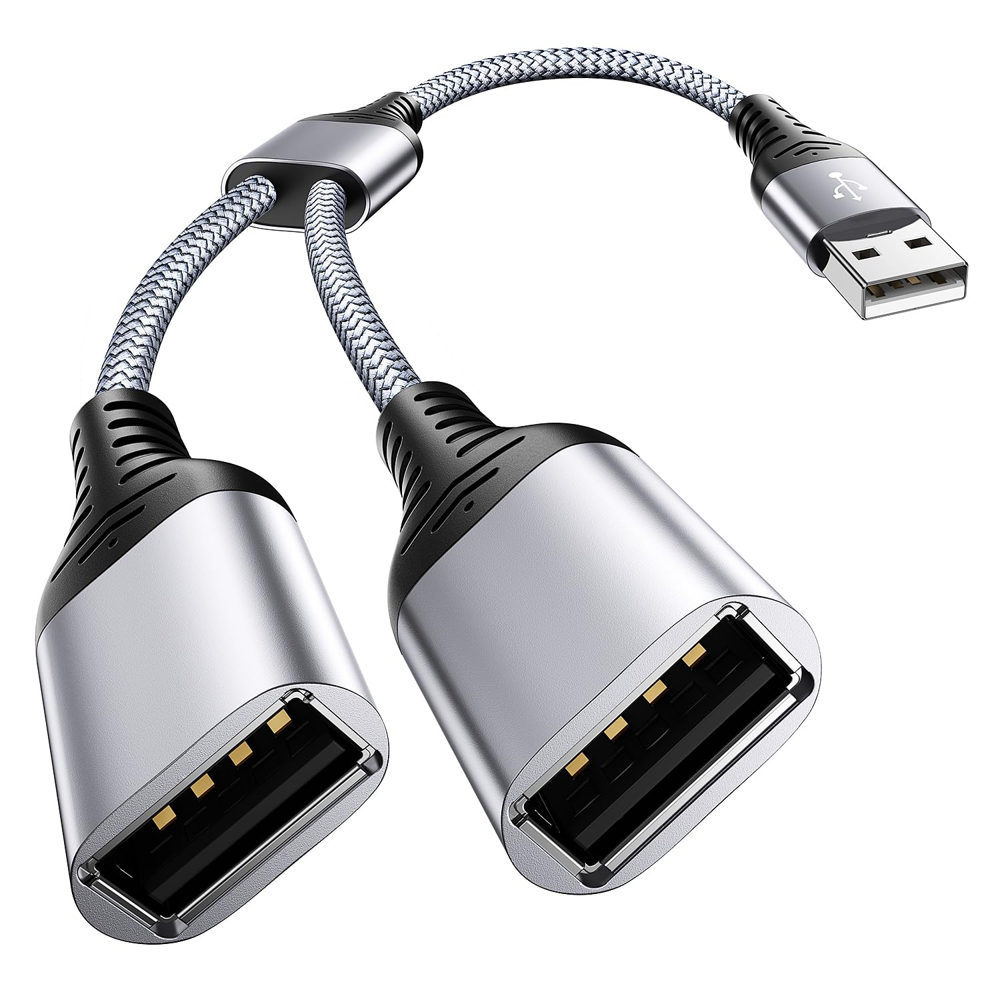
  <figcaption>Image 3: USB splitter</figcaption>
</figure>

- **(3)** **Pass-through ("daisy chain")**: many expansion modules have a **second connector** that repeats the bus signals (daisy chaining). You plug one module into the board and another into that second connector; both share the same bus (each with its own address). As in image 4.

<figure>
  
  <figcaption>Image 4: Pmod HYGRO (humidity and temperature sensor) over I²C (HDC1080 chip) with daisy chaining. It has a second PMOD connector that repeats the bus (pass-through).</figcaption>
</figure>

### 2.2 Moisture sensor: capacitive vs resistive

There are two common ways to measure soil moisture:

| Type | Idea | Problem |
|------|------|---------|
| **Resistive** | Two metal probes in the soil; measure resistance between them. Water conducts electricity, so more moisture = less resistance. | The metal **oxidizes** in contact with soil and moisture; the reading drifts and you have to recalibrate often. |
| **Capacitive** | Measure **capacitance** (how "chargeable" the area around the sensor is). Moisture changes that capacitance. | No metal exposed to the soil; no oxidation. More stable readings. |

We use a **capacitive** sensor. It does not put DC current into the soil and has no exposed metal probes, so it is better suited for plants in the long run.

### 2.3 What is I²C?

**I²C** (Inter-Integrated Circuit) is a **communication protocol**: rules that define how several chips send and receive data over a shared bus. I²C uses one power wire, one ground wire, and two data wires:
  - **SDA** (Serial Data): where data travels.
  - **SCL** (Serial Clock): the clock signal that defines when each bit is read.

One chip acts as the **controller** (master): it starts conversations and generates the clock. In our case that is the **GRiSP**. The others are **targets** (slaves): they only respond when the controller calls them by **address** (a 7-bit number, e.g. 0x36). Several sensors can be on the same bus; each has a different address.

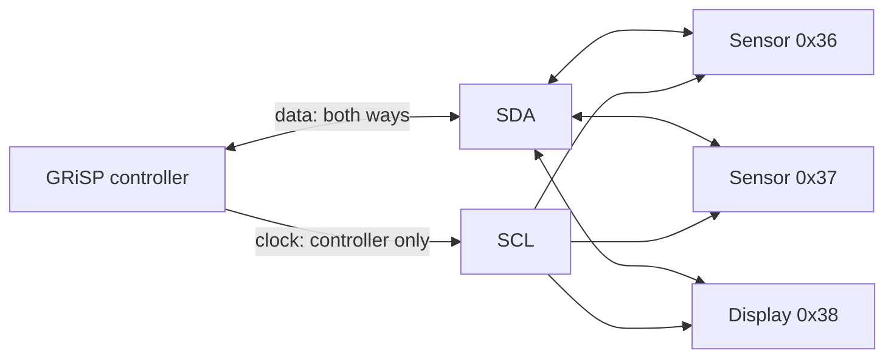

Communication on the bus is **sequential**: only one transaction at a time. The I²C standard allows up to **128 addresses** (0x00–0x7F) on one bus; the more devices, the more turns and the more work for the controller.

The protocol works with its two data lines in a way similar to a music score: SCL is the metronome and SDA is the score. Below we describe what each line does, when a bit is considered valid (0 or 1), and the steps of a typical transaction.

<figure>
  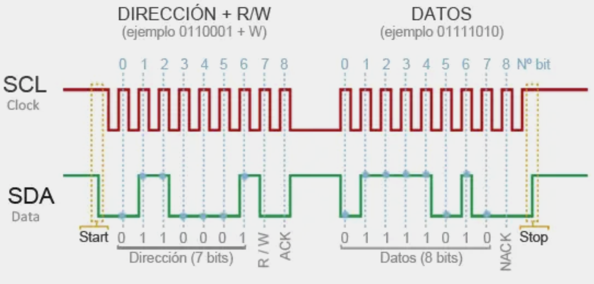
  <figcaption>Image 5: SCL + SDA</figcaption>
</figure>

As in **Image 5**, **SCL** (Serial Clock) is the red trace: the controller generates the pulses and each one marks when **one bit** is read or written on **SDA** (Serial Data), the green line where data travels.

To know whether that bit on SDA is 0 or 1 there is a fixed rule: **sample the green line (SDA) when the red one (SCL) is high**; at that moment the value is stable (low = 0, high = 1). When SCL is low, the device may change the value on SDA; that is why we sample SDA when SCL is high, when the value is stable.

A typical transaction follows these steps:

- **(1) Start condition:** The controller signals the start of a new transaction (e.g. pull SDA low while SCL is high).
- **(2) Address:** It sends **8 bits** on SDA (7 bits of device address plus 1 read/write bit), **one bit per SCL pulse**; the receiver knows "who" it is for.
- **(3) ACK:** Only the device whose address matches responds with an acknowledge bit (ACK) on the next pulse; the rest do nothing.
- **(4) Data:** Then one or more **8-bit bytes** go at the SCL rate, either from controller to device or the other way.
- **(5) Stop:** The controller ends the transaction with a stop condition.

> *As an optional resource, you can see a clock-and-data simulation at [Falstad – clocked SR flip-flop](https://www.falstad.com/circuit/e-clockedsrff.html). Ignore the logic gates at the top and look at the bottom: how the clock (like SCL) marks the instants and the other signal (like SDA) carries the data on each pulse. It illustrates the "clock + data" relationship we described for SDA and SCL.*

In short: I²C = protocol to talk to many chips with just 2 wires (plus power and ground), using addresses to know who you are talking to.

### 2.4 What is PWM?

**PWM (Pulse Width Modulation)** is a way to control the "amount" of something (light, motor speed, servo position) without changing the supply voltage.

As in image 6, you send a signal that **switches on and off** periodically. That signal is a train of **pulses**: for part of the time the voltage is high (e.g. 3.3 V) and for another part it is low (0 V). What you control is not the voltage but **how long** it stays high relative to the cycle: the **duty cycle**, i.e. the fraction of the period the signal is high. Higher duty cycle → more "effect" (brighter LED, faster DC motor, or different servo position).

<figure>
  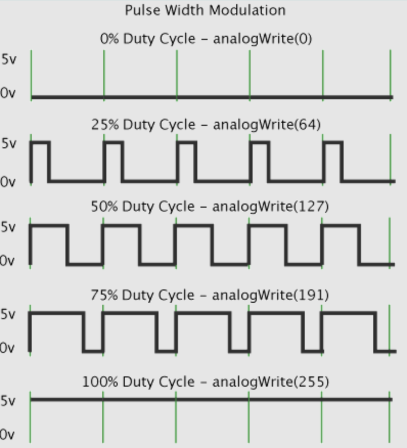
  <figcaption>Image 6: PWM — period, pulse width, and duty cycle.</figcaption>
</figure>

**Frequency and pulse width.** The **frequency** is how many times per second the cycle repeats (e.g. 50 Hz = 50 cycles per second). It is usually fixed for the device. What you **modulate** (change) is the **pulse width**: how many microseconds or milliseconds the signal is high each cycle. For a typical servo, pulse width sets the position: e.g. 1 ms = one end, 1.5 ms = center, 2 ms = other end, with a fixed period (e.g. 20 ms at 50 Hz).

**In Eustaquia:** We use PWM for the **servo** that moves the face. The board generates a signal at ~50 Hz and changes the pulse width to choose the position: one width for "happy" and another for "sad". The module `grisp_pwm` drives that signal.

### 2.5 What is PMOD? What is Digilent?

**PMOD (peripheral module)** is an expansion-module standard created by **Digilent**. They are small, low-cost boards that, together with their **connectors** and the board’s **PMOD host port**, let you connect peripherals without soldering.

The main parts are:
- **(1) Host port:** The connector on the board (e.g. GRiSP) that exposes power, ground, and the protocol lines (I²C, SPI, etc.).
- **(2) PMOD module:** The small board with the sensor, display, or circuit; on one side it has the connector that plugs into the host (or another module). See image 7.

<figure>
  
  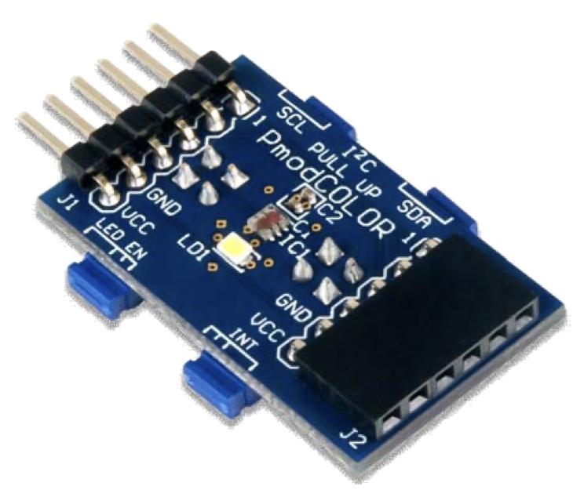
  <figcaption>Image 7: Example PMOD modules: Pmod HYGRO (humidity/temperature) and Pmod COLOR.</figcaption>
</figure>

- **(3) Pass-through port (daisy chaining):** Many modules have a **second connector** that repeats the host signals. So you can plug one PMOD into the board and a **second** PMOD into that connector; both share the same bus. Chaining lets you connect **several devices** with a single host port: the board only uses one connector and the modules form a "chain" (daisy chain), all on the same I²C (or SPI) bus, each with its own address. As in image 8.

<figure>
  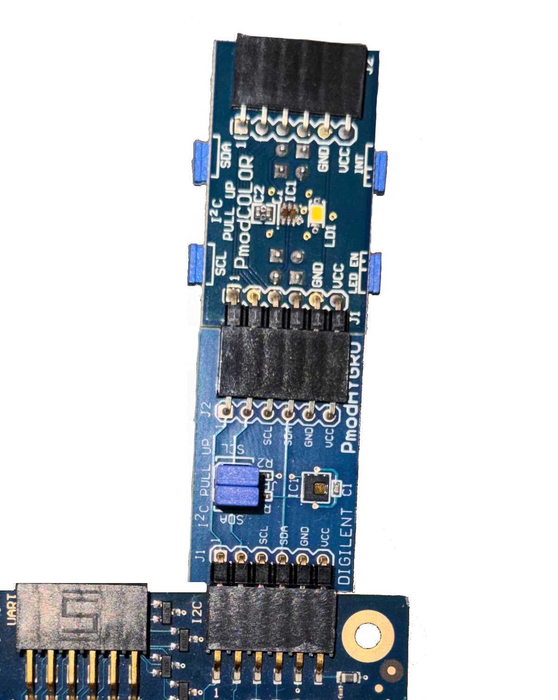
  <figcaption>Image 8: Connection from the board’s PMOD host port to two PMOD modules: Pmod HYGRO in daisy chain with Pmod COLOR.</figcaption>
</figure>

Each module implements a **specific protocol** (I²C, SPI, UART, etc.).

**What if you don’t have a PMOD module?**

The board’s **PMOD host port** is still usable: it exposes the board’s signals (power, ground, SDA, SCL, etc.) on a standard connector. Without a PMOD module you can use that port with other devices as long as you adapt the wiring (the connector may be more fragile and the pins easy to damage).

One example is connecting the **Adafruit soil moisture sensor** (STEMMA Soil Sensor) to Digilent’s **PMOD I²C** module pin-to-pin: VIN, GND, SDA, and SCL of the sensor to the PMOD. You can find this in both datasheets: [Adafruit (soil sensor)](https://learn.adafruit.com/adafruit-stemma-soil-sensor-i2c-capacitive-moisture-sensor/pinouts) and [Digilent (PMOD I²C)](https://digilent.com/blog/new-i2c-standard-for-pmods/). Image 9 shows the result; table 1 gives the pin mapping (signals with the same name must be connected together).

<figure>
  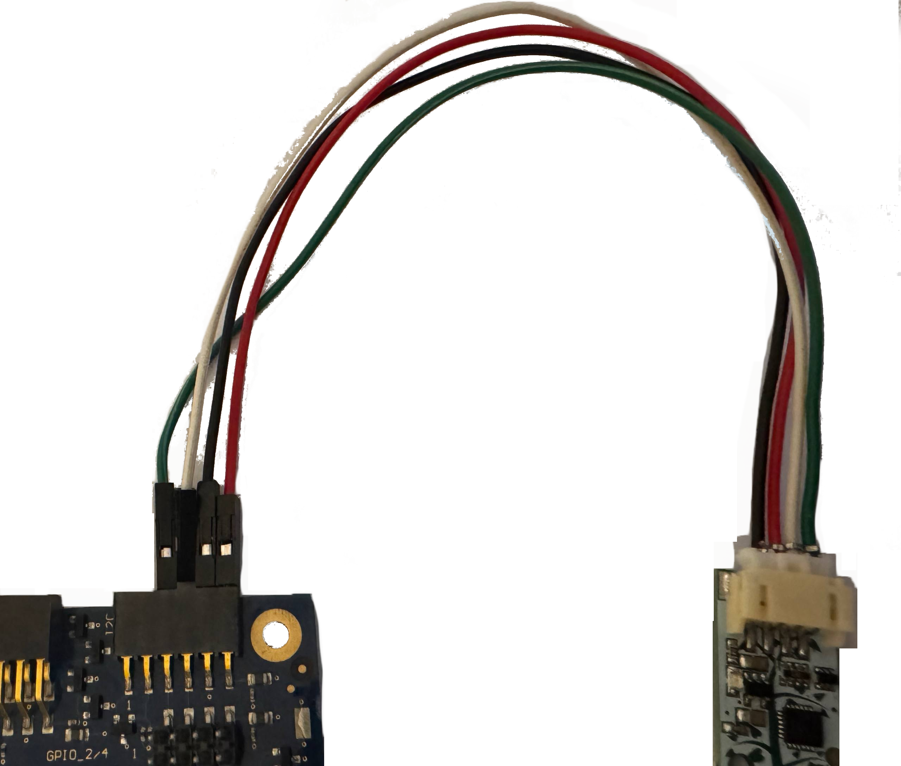
  <figcaption>Image 9: Adafruit Soil sensor (moisture) connected to PMOD I²C.</figcaption>
</figure>

| PMOD pin | PMOD I²C signal (Digilent) | Adafruit Soil signal | Adafruit pin |
|----------|----------------------------|----------------------|--------------|
| 1        | RST (reset)                | —                    | —            |
| 2        | INT (interrupt)            | —                    | —            |
| 3        | SCL                        | SCL                  | 4            |
| 4        | SDA                        | SDA                  | 3            |
| 5        | GND                        | GND                  | 1            |
| 6        | VCC (3.3 V or 5 V)         | VIN                  | 2            |

*Table 1: PMOD I²C (Digilent) to Adafruit soil moisture sensor (STEMMA Soil) pin mapping.*

### 2.6 Firmware

Firmware is software that lives inside a device and is stored in non-volatile memory (ROM, flash, microSD): when you power the device on, the processor starts by running that code. It is not "a program you open on the PC" but the image (system + application) that is written to the hardware and that the device runs every time it boots. Examples: the router’s firmware, the sensor’s firmware, the GRiSP’s firmware, or a smartwatch’s firmware.

## 3. Libraries and dependencies: what they are and why we need them

The project depends on a few libraries. Here we explain **what each one is for** and **what role it has** in Eustaquia.

### 3.1 grisp (main dependency)

**What it is:** The [GRiSP](https://www.grisp.org) library and runtime: it lets you compile, flash, and run Erlang/OTP on the GRiSP board (on RTEMS). It includes **drivers** (in C) and **Erlang APIs** to talk to the hardware. *(**Drivers** are programs that access the hardware directly: they read and write chip registers, configure pins, handle interrupts. They are usually in C because they must touch memory and peripherals at a low level. GRiSP already provides I²C, PWM, etc.; from Erlang you only use the API that calls that code.)*

**Why we need it:** We need the code GRiSP provides to access the hardware.

**What we use from it:**

| Module / API | Function | Where we use it |
|--------------|----------|------------------|
| **grisp_i2c** | Opens an I²C bus (`open/1`), sends and receives messages (`transfer/2`), optionally detects devices (`detect/1`). Under the hood it calls the I²C driver in C. | `seesaw.erl`, `seesaw_device.erl`: all communication with the sensor (write register address, read bytes). |
| **grisp_pwm** | Starts the PWM driver (`start_driver/0`), opens a pin in PWM mode (`open/3`), sets duty cycle (`set_sample/2`), closes the pin (`close/1`). The servo is driven by a PWM signal at ~50 Hz. | `servo_emo.erl`: move the face (happy = one duty cycle, sad = another). |

*Table 2: GRiSP modules we use in the project.*

**Summary:** `grisp` gives us **hardware access** (I²C and PWM). We do not implement that access; we only use it from Erlang and on top of it we implement the sensor **protocol** (seesaw) and the application **logic** (Eustaquia).

### 3.3 timer (part of Erlang/OTP)

**What it is:** The `timer` module is part of the **Erlang/OTP standard library** (not an external dependency). It provides `timer:sleep(Millisec)` and other time utilities.

**Why we need it:** The seesaw protocol (and the reference Arduino code) requires **waiting a bit** after requesting a register before reading the response (the chip needs time to perform the measurement). We use `timer:sleep(DelayMs)` in `seesaw.erl` for that delay (e.g. 10 ms for moisture, 100 ms for temperature).

**Function:** Pause the current process for X milliseconds without blocking the rest of the system.

### 3.4 rebar3 and Mix GRiSP

- **rebar3 grisp** is the rebar3 plugin for GRiSP (the Erlang build tool). It integrates the GRiSP workflow: besides compiling, it lets you **build the firmware** (the image written to the GRiSP: RTEMS, Erlang/OTP runtime, and your app) and **flash it** onto the board (e.g. `rebar3 grisp deploy` or `rebar3 grisp burn`). With `rebar3 grisp deploy` that image is built and written to the microSD (or whatever method you use), and the board runs it at boot.

- **Mix GRiSP** is the equivalent in the **Elixir** ecosystem: Mix is Elixir’s build tool (like rebar3 for Erlang); the GRiSP project or tasks for Mix let you compile and deploy firmware to the board from an Elixir project.

## 5. Adafruit sensor characteristics (explained)

We use the **[Adafruit STEMMA Soil Sensor - I²C Capacitive Moisture Sensor](https://www.adafruit.com/product/4026)** (JST-PH 2 mm connector). This section summarizes its characteristics in plain language.

| Characteristic | Value / description |
|----------------|---------------------|
| Type | Capacitive (single probe, no exposed metal) |
| Moisture range | ~200 (dry) to ~2000 (wet) |
| Temperature | Internal, ~±2 °C |
| Power | 3–5 V DC |
| Communication | I²C, default address 0x36 |
| Protocol over I²C | Seesaw (2-byte registers) |
| Connector | 4-pin JST-PH (VIN, GND, SDA, SCL) |

### 5.1 Measurement type: capacitive

It measures moisture by **capacitance**, not by resistance between two probes. Single probe, no metal exposed to the soil; it does not oxidize and does not inject DC current into the substrate. Suited for continuous use with plants.

### 5.2 Moisture reading range

- **Typical values:** About **200 (very dry)** to **2000 (very wet)**. Values in between depend on soil type and how the sensor is buried.

### 5.5 I²C address and protocol

- **Default address:** 0x36 (54 in decimal). That is what our code uses.
- **Protocol:** The sensor does not speak "generic I²C" but a specific protocol called **seesaw**: each quantity (moisture, temperature) lives in a **register** identified by **two bytes** (module + register). So our code sends 2 bytes to say "I want this register" and then reads the response.

### 5.6 Internal chip and Seesaw firmware: who implements what

Inside the Adafruit STEMMA Soil Sensor is a microcontroller from the **ATSAMD09 / ATSAMD10** family (ARM Cortex-M0+). That chip runs the **Seesaw firmware** (open source, [adafruit/seesaw](https://github.com/adafruit/seesaw)): it handles the register map, does the capacitive measurement (touch/ADC), reads the internal thermometer, and answers over I²C when the GRiSP asks for data.

**We do not implement that firmware** — it comes with the sensor. What we do implement is the **host side of the protocol** in Erlang (`seesaw.erl`): which bytes to send to request each register, when to wait before reading, and how to interpret the response (e.g. 2 bytes → moisture; 4 bytes → temperature as fixed-point). Summary: the sensor chip = Seesaw firmware (already there); the GRiSP = protocol client (our code).

Implementation details (registers 0x0F/0x10 and 0x00/0x04, temperature formula raw/65536, delays and retries, use of `grisp_i2c:transfer`) are **documented in the code** in `hum_sensor.erl` and `seesaw.erl` (`-doc` attributes and comments); the original sources (RegisterMap.h, Arduino, etc.) are cited in the project.

## 6. GRiSP board characteristics (explained)

The **[GRiSP](https://www.grisp.org)** is a board that runs **Erlang/OTP** directly on a real-time system (**RTEMS**), without Linux; that lets you program sensors and actuators in Erlang instead of C or the Arduino ecosystem.

Summary:

| Characteristic | Description |
|----------------|-------------|
| System | RTEMS + Erlang/OTP (no Linux) |
| I²C | Two buses: i2c0 (internal), i2c1 (external). We use i2c1. |
| I²C API | `grisp_i2c`: open, transfer, read, write, detect. |
| I²C driver | Implemented in C in the runtime; from Erlang only the API is used. |
| Connectors | PMOD (and others); we use PMOD I²C for the sensor. |

### 6.1 I²C API: grisp_i2c

I²C communication from Erlang is done with the **[grisp_i2c](https://hexdocs.pm/grisp/grisp_i2c.html)** module:

- **`open(Name)`** — Opens a bus (e.g. `i2c1`) and returns a reference for use in later calls.
- **`transfer(Bus, Messages)`** — Sends a list of operations: writes (bytes to a device) or reads (how many bytes to read from a device). Each message includes the chip **address** (1–127) and the data or length.
- **`read(Bus, Address, Register, Length)`** / **`write(...)`** — Shortcuts for chips that use **one byte** of register address. Our sensor uses **two bytes** (seesaw protocol), so we use **`transfer`** instead of these shortcuts.

The real "driver" (the code that touches the I²C hardware) is in **C** inside the GRiSP runtime; we only use the Erlang API.

## 7. Software layers (who does what)

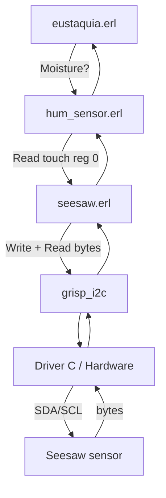

In summary, each layer does the following:

- **grisp_i2c:** Erlang API that comes with GRiSP. It opens the bus and sends/receives messages (write/read). The real driver (hardware access) is in C below.
- **seesaw.erl:** Implements the **seesaw protocol** in Erlang: "to read this register I send these 2 bytes and read N bytes". It only uses `grisp_i2c` (open + transfer).
- **hum_sensor.erl:** Knows which registers are moisture and temperature; applies delays and retries (as in Arduino) and returns useful values (moisture 0–65535, temperature in °C).
- **eustaquia.erl:** Plant logic: every X seconds it reads moisture, compares with a threshold, and moves the servo (happy/sad face).

### 7.1 seesaw.erl and seesaw_device.erl: what each one is

There are **two modules** with similar names; they do different things:

| Module | What it is | What it is for |
|--------|------------|----------------|
| **seesaw** | **Protocol** implementation in Erlang. Pure functions: "give me bus + address + register + length (and optionally a delay), and I talk over I²C and return the bytes". Each call to `seesaw:read(...)` or `seesaw:write(...)` opens the bus and does its own transfer. | Read or write any register of any seesaw device (moisture, temperature, etc.). It is the layer `hum_sensor` uses. No state; no serialization. |
| **seesaw_device** | A **process** (gen_server) that represents "one seesaw device on a given bus and address". It keeps the bus open, receives read/write requests, and runs them **one after another** (in series). | Useful when **several processes** in your application want to use the same sensor at once: instead of each calling `seesaw:read(...)` on its own (and mixing I²C traffic), they all ask the same `seesaw_device` process, which does one operation at a time. |

**Summary:** `seesaw` = "the protocol" (how to talk to a seesaw chip over I²C). `seesaw_device` = "a process that uses that protocol and serializes access" for one bus+address. In Eustaquia only one process (the moisture loop) touches the sensor, so we use **only seesaw** (from `hum_sensor`). If you later add another process that also reads the sensor, you could start a `seesaw_device` and have both talk to the sensor through it.

## 8. How to verify everything works (step by step)

For the concrete steps (connect hardware, compile, flash the board, open the console, run the tests), see the project **[README](../README.md)**: it has the commands and the *Testing* section with the calls to check the sensor and the servo.
